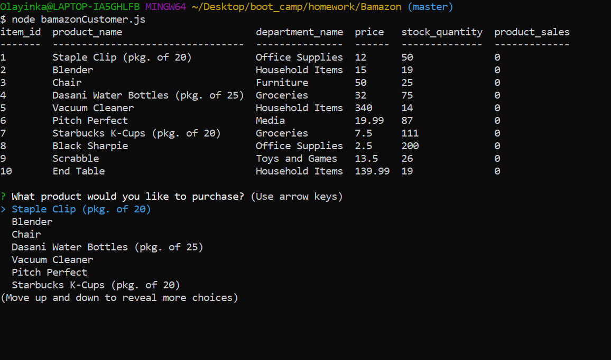
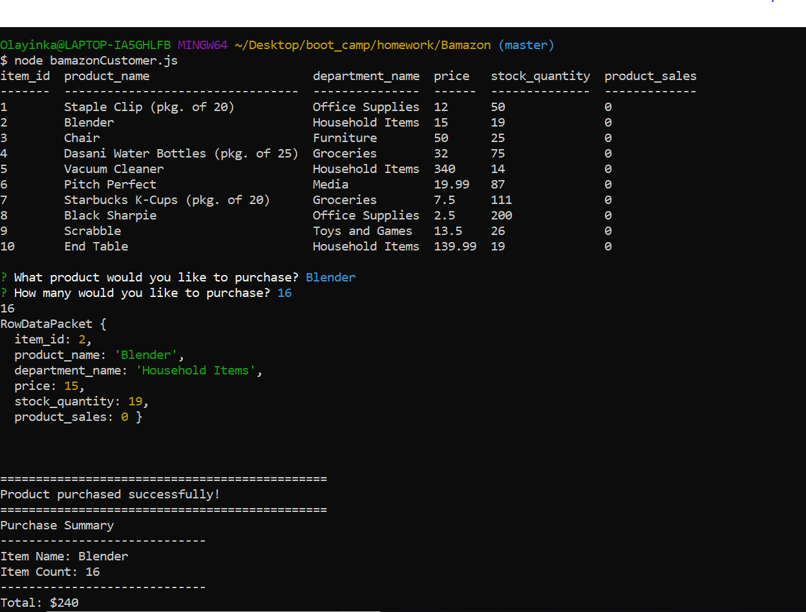
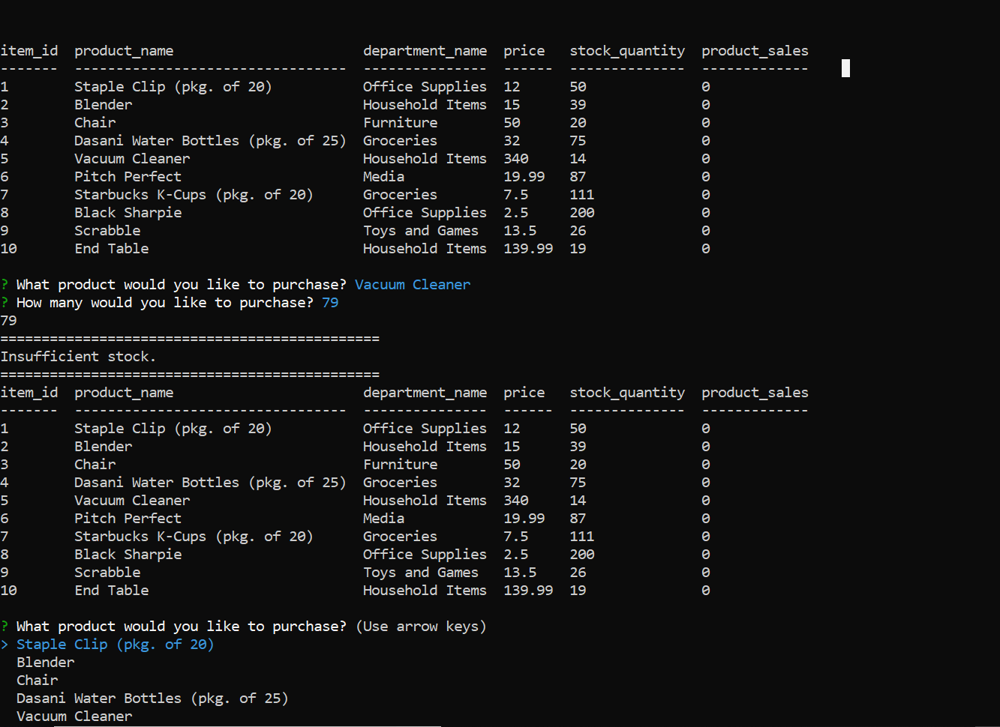
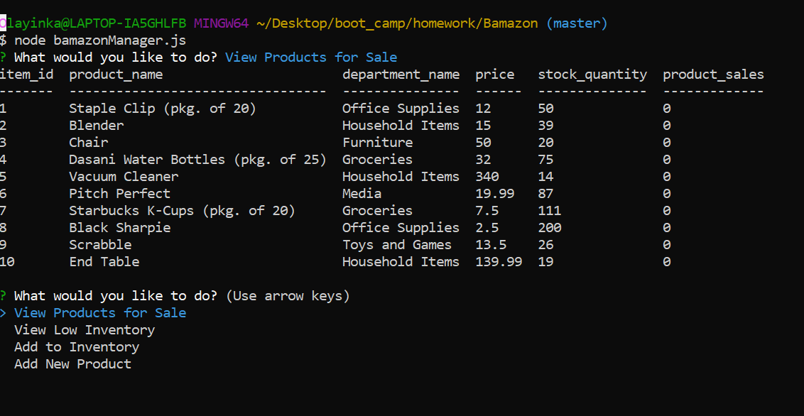
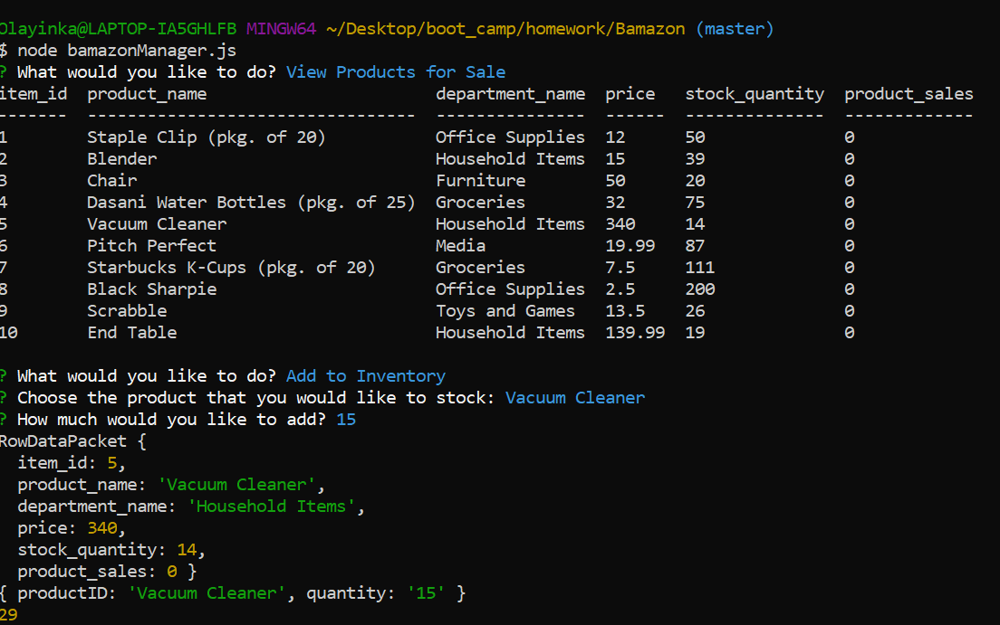
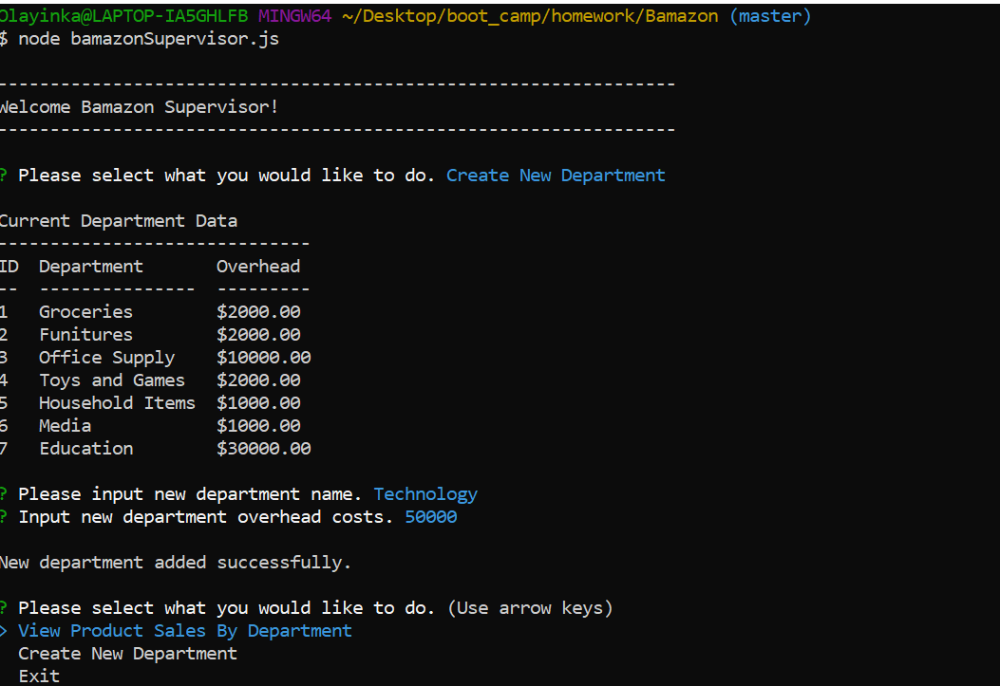

# Bamazon
Overview
This is an Amazon-like storefront with a MySQL database. The app will take in orders from customers and deplete stock from the store's inventory.

# BamazonCustomer.js

# BamazonManager.js

# BamazonSupervisor.js

